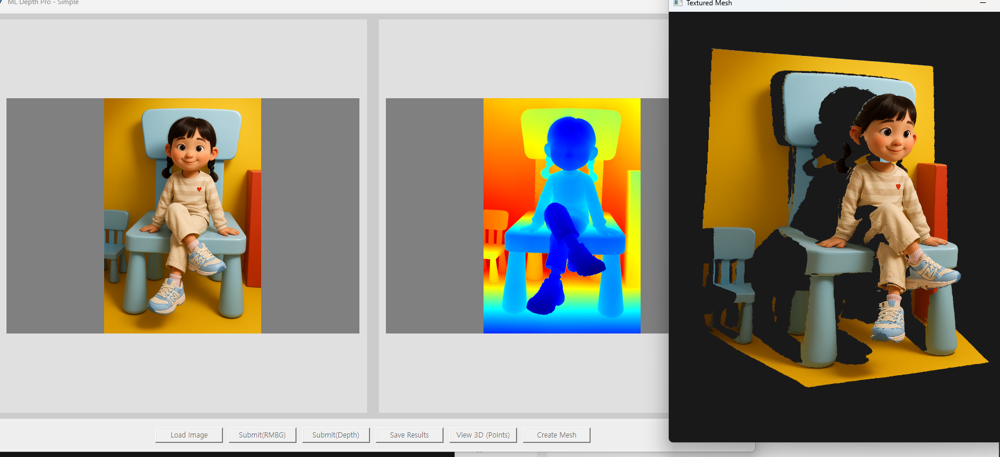

# 2D 이미지에서 3D 모델 생성 프로젝트

## 개요

이 프로젝트는 Apple의 Depth Pro 기술, RMBG 2.0 배경 제거 모델, 그리고 Open3D를 사용하여 다음 기능을 제공합니다:
- 2D 이미지로부터 정확한 깊이 맵(Depth Map) 생성
- 배경 제거(RMBG 2.0)를 통한 더 정확한 3D 모델링
- 깊이 맵을 이용한 포인트 클라우드 생성
- 텍스처가 입혀진 3D 메시 생성 및 시각화



## 필요 패키지

```
torch
torchvision
transformers
numpy
PIL
tkinter
cv2
open3d
```

## 설치 방법

1. 필요한 라이브러리 설치:
```bash
pip install torch torchvision transformers numpy pillow opencv-python open3d
```

2. Depth Pro 모델 다운로드:
```bash
bash get_pretrained_models.sh
```

3. 파이썬 패키지 설치:
```bash
pip install -e .
```

## 사용 방법

1. 다음 명령으로 애플리케이션 실행:
```bash
python run.py
```

2. 실행하면 스크린샷과 같은 UI가 나타납니다.

3. UI에서 다음 기능을 사용할 수 있습니다:
   - `Load Image`: 분석할 2D 이미지 로드
   - `Submit(RMBG)`: 배경 제거 실행
   - `Submit(Depth)`: 깊이 맵 생성
   - `Save Results`: 결과 저장
   - `View 3D (Points)`: 포인트 클라우드 시각화
   - `Create Mesh`: 텍스처가 입혀진 3D 메시 생성 및 시각화

## 라이선스 및 참고 사항

### Depth Pro
- 출처: [Apple ML Depth Pro](https://github.com/apple/ml-depth-pro)
- 라이선스: Apple의 ML Depth Pro는 Apache 2.0 라이선스로 제공됩니다.

### RMBG 2.0
- 출처: [BRIA AI RMBG 2.0](https://github.com/briaai/RMBG-2.0)
- 라이선스: BRIA AI의 RMBG 2.0은 Apache 2.0 라이선스로 제공됩니다.

### Open3D
- 출처: [Open3D](http://www.open3d.org/)
- 라이선스: Open3D는 MIT 라이선스로 제공됩니다.

이 프로젝트는 연구 및 교육 목적으로만 사용하시기 바랍니다.